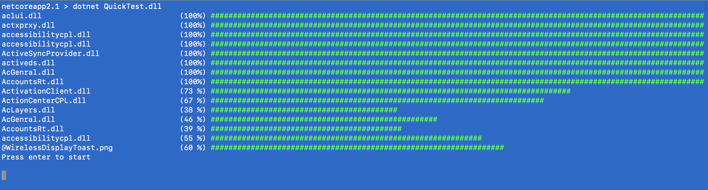

# (Goblinfactory.Konsole) progress-bar
- C# (dotnet standard) console progress bar with support for single or multithreaded progress updates.

### `Install-Package Goblinfactory.ProgressBar`


## Notes


##ProgressBar Usage
```csharp

    using Goblinfactory.ProgressBar;

           . . .

            var pb = new ProgressBar(50);
            pb.Refresh(0, "connecting to server to download 50 files sychronously.");
            Console.ReadLine();

            pb.Refresh(25, "downloading file number 25");
            Console.ReadLine();
            pb.Refresh(50, "finished.");
```
produces the following output
```
Item 0     of 50   . (0  %)
connecting to server to download 50 files sychronously.
```
(press enter)

```
Item 25    of 50   . (50%) ######################################
downloading file number 25
```

(press enter again)

```
Item 50    of 50   . (100%) ############################################################################
finished.
```

##example of showing status update for parallel tasks

This example creates 10 seperate console progress bars, each being updated on a seperate thread. (This code generates the output visible in the animated gif.)

```csharp

            // demo; take the first 10 directories that have files from c:\windows, and then pretends to process (list) them.
            // processing of each directory happens on a different thread, to simulate multiple background tasks,
            // e.g. file downloading.
            // ==============================================================================================================
            var dirs = Directory.GetDirectories(@"c:\windows").Where(d=> Directory.GetFiles(d).Count()>0).Take(10);

            var tasks = new List<Task>();
            var bars = new List<ProgressBar>();
            foreach (var d in dirs)
            {
                var dir = new DirectoryInfo(d);
                var files = dir.GetFiles().Take(100).Select(f=>f.FullName).ToArray();
                if (files.Count()==0) continue;
                var bar = new ProgressBar(files.Count());
                bars.Add(bar);
                bar.Refresh(0, d);
                tasks.Add(new Task(() => ProcessFiles(d, files, bar)));
            }
            Console.WriteLine("ready press enter.");
            Console.ReadLine();

            foreach (var t in tasks) t.Start();
            Task.WaitAll(tasks.ToArray());
            Console.WriteLine("done.");
            Console.ReadLine();

        }

        public static void ProcessFiles(string directory, string[] files, ProgressBar bar)
        {
            var cnt = files.Count();
            foreach (var file in files)
            {
                bar.Next(new FileInfo(file).Name);
                Thread.Sleep(150);
            }
        }


```

## Still Todo

- finish documentation for ProgressBarSlim and ProgressBar.
- Include tests
- more manual testing

## Mac Screenshots

Multi threaded test using `ProgressBarSlim` on mac ternimal.


